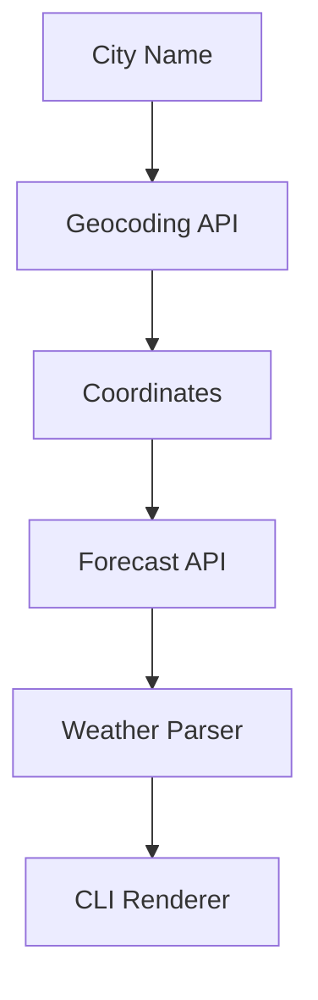

<h1 align="center">🌦️ SkyQuery</h1>

<p align="center">
A modern command-line weather client written in Python.
</p>

<p align="center">
Current Weather • Multi-Day Forecast • Caching • JSON Output • No API Key
</p>

<p align="center">


</p>

---

## Screenshot  

```text
Yerevan, Armenia
40.19°N, 44.50°E · 988 m · Asia/Yerevan

┌─────────────────────────────────────────────────────────┐
│ 🌤️  32.2°C                                              │
│ Mainly clear                                            │
│ Feels like 34.6°C                                       │
├─────────────────────────────────────────────────────────┤
│ Wind           7.7 km/h SSW (gusts 18)                  │
│ Humidity       34%                                      │
│ Cloud cover    40%                                      │
│ Precipitation  0.0 mm                                   │
│ Pressure       1012 hPa                                 │
│ Sun            06:01 → 20:14                            │
│ UV index       8.2 (very high)                          │
└─────────────────────────────────────────────────────────┘
Observed Mon 03 Aug, 12:30 local time

5-day forecast

DAY                       HI/LO    RAIN  CONDITIONS
Mon 03 Aug   ☁️     36°C / 25°C       —  Overcast
Tue 04 Aug   ⛅     38°C / 24°C       —  Partly cloudy
Wed 05 Aug   ⛅     36°C / 24°C       —  Partly cloudy
Thu 06 Aug   ⛅     33°C / 22°C       —  Partly cloudy
Fri 07 Aug   ⛅     34°C / 23°C       —  Partly cloudy
```

> You can replace the text preview above with an actual terminal screenshot later:
>
> ```md
> 
> ```

---

## Contents

- Features
- API
- Architecture
- Setup
- Usage
- Configuration
- Caching
- Error Handling
- Project Structure
- Tests
- What I Learned
- Roadmap
- License

---

# SkyQuery — Weather CLI

A command-line weather client written in Python. Give it a city name and it
prints current conditions plus a multi-day forecast in your terminal — no API
key, no account, no signup.

SkyQuery is a small project with a specific focus: **doing real HTTP work
safely**. Networks time out, servers return 503, DNS fails, JSON arrives
malformed, and a user will eventually type `Xyzzyville`. Every one of those
paths is handled and tested here — none of them produce a traceback.

---

## 🌟 Features

- ✅ City → coordinates → weather lookup
- ✅ Current weather conditions
- ✅ 1–16 day forecast
- ✅ Multi-city support
- ✅ Compact summary mode
- ✅ JSON output
- ✅ Response caching
- ✅ Metric and Imperial units
- ✅ Configurable defaults
- ✅ Automatic retries
- ✅ Graceful error handling
- ✅ ANSI colour support
- ✅ Emoji / ASCII terminal fallback

---

## 🌍 API Used

SkyQuery uses the excellent **Open-Meteo** service.

| Purpose | Endpoint |
| --- | --- |
| 📍 City → Coordinates | `geocoding-api.open-meteo.com/v1/search` |
| 🌦 Coordinates → Weather | `api.open-meteo.com/v1/forecast` |

No API key is required.

Weather conditions are returned as numeric WMO weather codes and mapped inside
`src/weather_codes.py`.

---

## 🏗 Architecture



---

## Setup

Requires Python 3.10+.

```bash
git clone https://github.com/yourname/skyquery.git
cd skyquery

python -m venv .venv

# Windows
.venv\Scripts\activate

# macOS / Linux
source .venv/bin/activate

pip install -r requirements.txt
```

---

## Usage

```bash
python -m src.main Yerevan
```

On Windows you can also run

```bash
py -3 -m src.main Yerevan
```

or

```bash
python src/main.py Yerevan
```

### Examples

```bash
# Current weather + 5-day forecast
python -m src.main Yerevan

# Several cities
python -m src.main Paris Tokyo "New York" --short

# 7-day forecast in Fahrenheit
python -m src.main London --days 7 --units imperial

# Current conditions only
python -m src.main Berlin --no-forecast

# Show all matching cities
python -m src.main Springfield --list

# Machine-readable output
python -m src.main Tokyo --json | jq '.current.temperature'
```

---

## Options

| Flag | Description |
| --- | --- |
| `--days` | Forecast length (1–16 days) |
| `--units` | Metric or Imperial |
| `--short` | One-line summary |
| `--list` | List matching cities |
| `--no-forecast` | Current conditions only |
| `--json` | JSON output |
| `--color` | Colour mode |
| `--timeout` | Request timeout |
| `--retries` | Retry attempts |
| `--no-cache` | Disable cache |
| `--cache-ttl` | Cache lifetime |
| `--clear-cache` | Delete cache |
| `--set-units` | Save default units |
| `--set-days` | Save default forecast length |
| `--show-config` | Print configuration |
| `--version` | Print version |

---

## Configuration

Configuration is stored inside

```
~/.skyquery/config.json
```

Example:

```json
{
  "cache_enabled": true,
  "cache_ttl": 600,
  "color": "auto",
  "forecast_days": 7,
  "language": "en",
  "retries": 2,
  "timeout": 10.0,
  "units": "imperial"
}
```

Priority:

```
CLI flags
        ↓
Config file
        ↓
Built-in defaults
```

---

## Caching

Responses are cached on disk under

```
~/.skyquery/cache
```

Default cache lifetime:

```
10 minutes
```

Cached responses display

```
(served from cache, 45s old)
```

Corrupt cache entries are automatically ignored.

---

## Error Handling

Every expected failure becomes a custom `SkyQueryError` subclass.

| Situation | Handling |
| --- | --- |
| No internet | Retry then NetworkError |
| DNS failure | Retry then fail |
| Timeout | Retry with exponential backoff |
| HTTP 5xx | Retry |
| HTTP 429 | Retry then explicit rate-limit message |
| HTTP 4xx | Immediate error |
| TLS error | Immediate failure |
| Invalid JSON | ResponseParseError |
| Missing fields | Render `—` where possible |
| Unknown weather code | Unknown conditions |
| City not found | Helpful spelling hint |
| Broken cache | Ignore cache |
| Broken config | Friendly message |
| Ctrl+C | Cancelled (exit code 130) |

---

## Project Structure

```text
skyquery/
├── src/
│   ├── main.py
│   ├── api_client.py
│   ├── display.py
│   ├── cache.py
│   ├── config.py
│   ├── weather_codes.py
│   └── errors.py
├── tests/
├── requirements.txt
├── requirements-dev.txt
└── README.md
```

---

## Built With

- Python 3.10+
- Open-Meteo API
- Requests
- Pytest

---

## Tests

```bash
pip install -r requirements-dev.txt
python -m pytest
```

```
113 passed in 1.86s
```

Tests never access the internet.

A stub HTTP session replays Open-Meteo responses, including failures such as

- Timeouts
- HTTP 500
- HTTP 429
- Invalid JSON
- Truncated JSON

Configuration and cache are redirected to a temporary directory during testing.

---

## What I Learned

- Consuming REST APIs
- Safe HTTP programming
- Retries with exponential backoff
- Defensive JSON parsing
- Disk caching
- Configuration management
- Separation of concerns
- Testable architecture
- Terminal rendering
- ANSI colour handling
- Cross-platform CLI development

---

## Roadmap

- [ ] Query history
- [ ] Temperature trends
- [ ] Hourly forecast
- [ ] Severe weather alerts

---

## License

MIT

---

<p align="center">

Made with ❤️ in Python

</p>

<p align="center">

⭐ If you found this project useful, consider giving it a star.

</p>
